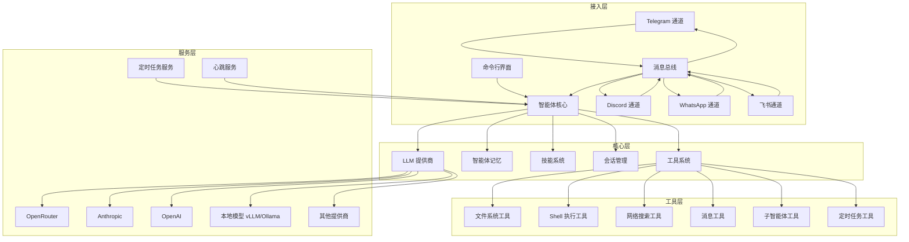
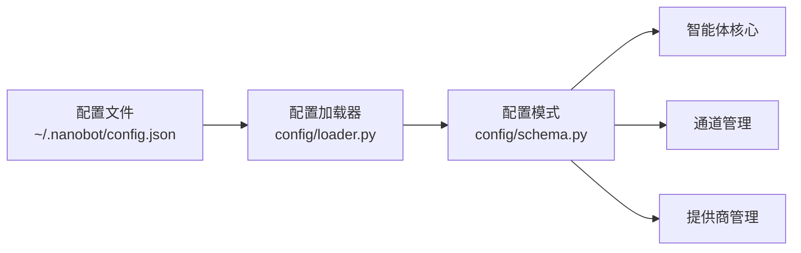
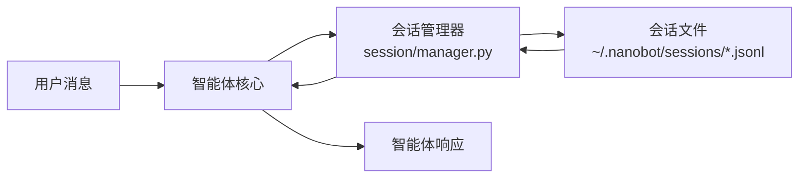
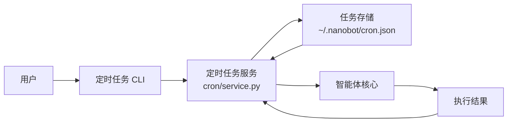

# nanobot 架构分析文档

## 1. 系统整体架构

### 1.1 架构概览

nanobot 是一个超轻量级个人 AI 助手框架，采用模块化、事件驱动的架构设计。系统通过消息总线实现各组件间的解耦，使用异步处理提高性能和响应速度。

### 1.2 核心模块划分

| 模块 | 主要职责 | 文件位置 | 核心功能 |
|------|---------|---------|----------|
| **智能体核心** | 处理用户输入，调用 LLM，执行工具 | `nanobot/agent/` | 智能体循环、上下文构建、工具执行 |
| **消息总线** | 消息路由和分发 | `nanobot/bus/` | 入站/出站消息处理、通道订阅 |
| **通道管理** | 多平台集成 | `nanobot/channels/` | Telegram、Discord、WhatsApp、飞书集成 |
| **提供商管理** | LLM 服务集成 | `nanobot/providers/` | 多提供商支持、模型路由 |
| **会话管理** | 对话历史存储 | `nanobot/session/` | 会话持久化、历史记录管理 |
| **配置管理** | 系统配置 | `nanobot/config/` | 配置加载、模式验证 |
| **定时任务** | 计划任务执行 | `nanobot/cron/` | 定时任务调度、执行 |
| **心跳服务** | 系统健康检查 | `nanobot/heartbeat/` | 周期性检查、唤醒机制 |
| **命令行界面** | 用户交互 | `nanobot/cli/` | 命令处理、参数解析 |
| **技能系统** | 功能扩展 | `nanobot/skills/` | 第三方功能集成 |
| **工具系统** | 环境交互 | `nanobot/agent/tools/` | 文件操作、网络搜索、Shell 执行 |

### 1.3 系统架构图



## 2. 核心模块分析

### 2.1 智能体核心 (Agent)

智能体核心是整个系统的大脑，负责处理用户输入、构建上下文、调用 LLM、执行工具并生成响应。

**核心组件**：
- `AgentLoop`：智能体主循环，处理消息流
- `ContextBuilder`：构建 LLM 上下文
- `SubagentManager`：管理后台任务执行

**工作流程**：
1. 从消息总线接收用户输入
2. 获取会话历史和上下文
3. 调用 LLM 生成响应
4. 处理工具调用请求
5. 执行工具并获取结果
6. 将结果发送回 LLM 继续处理
7. 生成最终响应并返回给用户

**代码位置**：`nanobot/agent/loop.py`

### 2.2 消息总线 (Bus)

消息总线是系统的神经中枢，负责在不同组件间传递消息，实现解耦和异步通信。

**核心功能**：
- 入站消息处理：接收来自各通道的用户输入
- 出站消息分发：将智能体响应发送到对应的通道
- 通道订阅机制：支持多通道并行处理

**代码位置**：`nanobot/bus/queue.py`

### 2.3 通道管理 (Channels)

通道管理模块负责集成各种聊天平台，使 nanobot 能够通过多种渠道与用户交互。

**支持的通道**：
- Telegram：使用 python-telegram-bot 库
- Discord：使用 Discord 机器人 API
- WhatsApp：通过自定义桥接服务
- 飞书：使用 WebSocket 长连接

**安全特性**：
- 用户白名单机制：限制可访问的用户
- 消息验证：确保消息来源可信

**代码位置**：`nanobot/channels/`

### 2.4 提供商管理 (Providers)

提供商管理模块负责集成各种 LLM 服务，支持多模型、多提供商的无缝切换。

**支持的提供商**：
- OpenRouter：全球模型网关
- Anthropic：Claude 模型
- OpenAI：GPT 模型
- DeepSeek：DeepSeek 模型
- Gemini：Google Gemini 模型
- DashScope：Qwen 模型
- Moonshot：Kimi 模型
- Zhipu：GLM 模型
- 本地模型：vLLM/Ollama

**核心特性**：
- 自动模型路由：根据模型名称选择合适的提供商
- API 密钥管理：安全存储和使用 API 密钥
- 模型前缀处理：自动添加必要的模型前缀

**代码位置**：`nanobot/providers/`

### 2.5 会话管理 (Session)

会话管理模块负责存储和管理用户对话历史，为智能体提供上下文信息。

**核心功能**：
- 会话持久化：以 JSONL 格式存储对话历史
- 历史记录管理：限制最大消息数，优化 LLM 上下文
- 会话元数据：存储会话相关的额外信息

**代码位置**：`nanobot/session/manager.py`

### 2.6 定时任务 (Cron)

定时任务模块允许用户设置计划任务，实现自动化操作。

**支持的调度方式**：
- 一次性任务：在指定时间执行
- 周期性任务：按固定间隔执行
- Cron 表达式：支持复杂的时间调度

**核心功能**：
- 任务管理：添加、删除、启用、禁用任务
- 状态跟踪：记录任务执行状态和结果
- 错误处理：捕获和记录任务执行错误

**代码位置**：`nanobot/cron/service.py`

### 2.7 工具系统 (Tools)

工具系统为智能体提供与环境交互的能力，扩展其功能范围。

**核心工具**：
- 文件系统工具：读取、写入、编辑文件，列出目录
- Shell 执行工具：执行系统命令
- 网络工具：网页搜索、内容抓取
- 消息工具：发送消息
- 子智能体工具：创建后台任务
- 定时任务工具：管理定时任务

**安全特性**：
- 工作区限制：可选择将工具操作限制在指定目录
- 执行超时：防止命令执行时间过长

**代码位置**：`nanobot/agent/tools/`

## 3. 模块间交互关系

### 3.1 消息流

1. **用户输入流**：
   - 用户 → 通道 → 消息总线 → 智能体核心 → LLM

2. **响应流**：
   - LLM → 智能体核心 → 消息总线 → 通道 → 用户

3. **工具执行流**：
   - 智能体核心 → 工具注册表 → 具体工具 → 执行结果 → 智能体核心

### 3.2 核心交互模式

**命令行交互**：
- 用户通过 CLI 发送命令
- 命令被解析并转换为内部消息
- 智能体处理消息并返回响应

**聊天平台交互**：
- 用户通过 Telegram/Discord/WhatsApp/飞书发送消息
- 通道接收消息并通过消息总线转发
- 智能体处理消息并生成响应
- 响应通过消息总线分发到对应通道
- 通道将响应发送给用户

**定时任务交互**：
- 定时任务服务触发任务
- 任务被转换为内部消息
- 智能体处理消息并执行相应操作
- 执行结果被记录

## 4. 技术栈选型

### 4.1 核心技术

| 技术/库 | 用途 | 版本要求 | 来源 |
|---------|------|---------|------|
| Python | 核心开发语言 | ≥ 3.11 | `pyproject.toml` |
| asyncio | 异步处理 | 内置 | `nanobot/agent/loop.py` |
| litellm | LLM 服务统一接口 | ≥ 1.0.0 | `pyproject.toml` |
| pydantic | 数据验证 | ≥ 2.0.0 | `pyproject.toml` |
| websockets | WebSocket 支持 | ≥ 12.0 | `pyproject.toml` |
| loguru | 日志管理 | ≥ 0.7.0 | `pyproject.toml` |
| python-telegram-bot | Telegram 集成 | ≥ 21.0 | `pyproject.toml` |
| croniter | Cron 表达式解析 | ≥ 2.0.0 | `pyproject.toml` |
| lark-oapi | 飞书集成 | ≥ 1.0.0 | `pyproject.toml` |
| TypeScript | WhatsApp 桥接服务 | - | `bridge/package.json` |

### 4.2 架构模式

- **事件驱动架构**：通过消息总线实现组件间通信
- **模块化设计**：清晰的责任分离和接口定义
- **插件系统**：通过技能和工具扩展功能
- **服务导向**：核心功能以服务形式组织

## 5. 数据流向设计

### 5.1 配置数据



### 5.2 会话数据



### 5.3 任务数据



## 6. 关键业务流程

### 6.1 智能体对话流程

1. **初始化**：
   - 加载配置
   - 初始化消息总线
   - 注册工具和技能
   - 连接到 LLM 提供商

2. **消息处理**：
   - 接收用户消息
   - 构建上下文（包含历史记录、工具信息等）
   - 调用 LLM 生成响应
   - 处理工具调用请求
   - 执行工具并获取结果
   - 将结果发送回 LLM 继续处理
   - 生成最终响应

3. **响应发送**：
   - 将响应通过消息总线分发到对应通道
   - 通道将响应发送给用户
   - 保存对话历史到会话

### 6.2 定时任务执行流程

1. **任务创建**：
   - 用户通过 CLI 创建定时任务
   - 任务被保存到存储
   - 定时服务计算下次执行时间

2. **任务调度**：
   - 定时服务监控任务执行时间
   - 当任务到期时触发执行

3. **任务执行**：
   - 任务被转换为内部消息
   - 智能体处理消息并执行相应操作
   - 执行结果被记录
   - 对于周期性任务，重新计算下次执行时间

### 6.3 多通道消息处理流程

1. **消息接收**：
   - 各通道监听对应平台的消息
   - 消息被标准化为内部格式
   - 通过消息总线发送到智能体

2. **消息路由**：
   - 智能体处理消息并生成响应
   - 响应包含目标通道信息
   - 消息总线根据通道信息分发响应

3. **响应发送**：
   - 对应通道接收响应
   - 响应被转换为平台特定格式
   - 发送到用户

## 7. 接口定义规范

### 7.1 消息格式

**入站消息**：
```python
class InboundMessage:
    channel: str  # 通道名称（telegram、discord、whatsapp、feishu、cli）
    sender_id: str  # 发送者 ID
    chat_id: str  # 聊天 ID
    content: str  # 消息内容
    media: dict | None  # 媒体内容（可选）
    session_key: str  # 会话键（通常是 channel:chat_id）
```

**出站消息**：
```python
class OutboundMessage:
    channel: str  # 通道名称
    chat_id: str  # 聊天 ID
    content: str  # 消息内容
    media: dict | None  # 媒体内容（可选）
```

### 7.2 工具接口

**工具基类**：
```python
class BaseTool:
    name: str  # 工具名称
    description: str  # 工具描述
    params: dict  # 参数定义
    
    async def execute(self, **kwargs) -> str:  # 执行方法
        pass
```

**工具调用格式**：
```json
{
  "name": "tool_name",
  "arguments": {
    "param1": "value1",
    "param2": "value2"
  }
}
```

### 7.3 配置接口

**核心配置结构**：
```json
{
  "providers": {
    "openrouter": {
      "apiKey": "sk-or-xxx",
      "apiBase": "https://openrouter.ai/api/v1"
    }
  },
  "agents": {
    "defaults": {
      "model": "anthropic/claude-opus-4-5"
    }
  },
  "channels": {
    "telegram": {
      "enabled": true,
      "token": "YOUR_BOT_TOKEN",
      "allowFrom": ["YOUR_USER_ID"]
    }
  },
  "tools": {
    "restrictToWorkspace": false
  }
}
```

## 8. 性能优化策略

### 8.1 异步处理

- 使用 `asyncio` 实现异步操作
- 非阻塞 I/O 提高并发性能
- 消息总线使用异步队列

### 8.2 内存管理

- 会话历史限制：默认最多保存 50 条消息
- 上下文构建优化：只包含必要信息
- 惰性加载：按需加载配置和资源

### 8.3 网络优化

- WebSocket 长连接：减少连接开销
- 批量请求：合并多个小请求
- 缓存机制：缓存频繁访问的数据

### 8.4 计算优化

- 工具执行超时：防止长时间运行的操作
- 并发控制：限制同时执行的任务数
- 资源限制：对工具执行设置资源限制

## 9. 安全架构设计

### 9.1 访问控制

- **用户白名单**：限制可访问的用户 ID
- **工作区限制**：可选择将工具操作限制在指定目录
- **命令执行限制**：对 Shell 命令执行设置限制

### 9.2 数据安全

- **API 密钥管理**：安全存储和使用 API 密钥
- **消息加密**：通过平台自带的加密机制保护消息
- **数据隔离**：不同用户的会话数据相互隔离

### 9.3 输入验证

- **参数验证**：对工具参数进行验证
- **路径验证**：防止路径遍历攻击
- **命令验证**：对 Shell 命令进行安全检查

### 9.4 错误处理

- **异常捕获**：全面捕获和处理异常
- **错误日志**：详细记录错误信息
- **安全响应**：对用户返回安全的错误信息

## 10. 扩展性考虑

### 10.1 模块扩展

- **提供商扩展**：通过简单的两步流程添加新的 LLM 提供商
- **通道扩展**：支持添加新的聊天平台集成
- **工具扩展**：可通过继承基类添加新工具
- **技能扩展**：支持第三方技能集成

### 10.2 配置扩展

- **分层配置**：支持默认配置和用户配置
- **环境变量支持**：可通过环境变量覆盖配置
- **动态配置**：运行时可调整部分配置

### 10.3 部署扩展

- **Docker 支持**：可通过 Docker 容器化部署
- **多环境支持**：支持开发、测试、生产环境
- **水平扩展**：可通过多实例部署提高处理能力

### 10.4 未来扩展方向

- **多模态支持**：集成图像、语音、视频处理能力
- **长期记忆**：实现更复杂的记忆管理系统
- **更好的推理**：增强多步规划和反思能力
- **更多集成**：支持 Slack、电子邮件、日历等更多服务
- **自我改进**：从反馈和错误中学习的能力

## 11. 技术债务与风险

### 11.1 技术债务

- **依赖管理**：依赖较多外部库，可能存在版本兼容性问题
- **错误处理**：部分模块的错误处理可以进一步完善
- **文档完善**：部分代码的文档注释可以更加详细

### 11.2 潜在风险

- **API 限制**：依赖的 LLM API 可能存在速率限制
- **安全漏洞**：工具执行可能存在安全风险
- **性能瓶颈**：在处理大量并发请求时可能存在性能瓶颈
- **可靠性**：依赖外部服务的可用性

## 12. 总结与建议

### 12.1 架构优势

- **模块化设计**：清晰的责任分离，便于理解和维护
- **事件驱动**：通过消息总线实现组件解耦
- **异步处理**：提高性能和响应速度
- **可扩展性**：支持多种方式扩展功能
- **多平台支持**：集成主流聊天平台
- **多模型支持**：支持多种 LLM 提供商和模型

### 12.2 改进建议

1. **安全增强**：
   - 进一步加强工具执行的安全限制
   - 实现更细粒度的访问控制

2. **性能优化**：
   - 实现更高效的会话存储机制
   - 优化 LLM 调用的参数和上下文构建

3. **功能扩展**：
   - 增加更多内置工具和技能
   - 支持更多聊天平台和服务集成

4. **可靠性提升**：
   - 实现更完善的错误处理和重试机制
   - 增加系统监控和健康检查

5. **开发体验**：
   - 提供更详细的开发文档
   - 增加更多示例和教程

### 12.3 未来发展方向

- **智能体生态系统**：构建围绕 nanobot 的生态系统
- **社区驱动**：鼓励社区贡献和扩展
- **企业级功能**：添加更多企业级功能和集成
- **标准化**：推动智能体接口和协议的标准化

## 13. 附录

### 13.1 核心文件结构

```
nanobot/
├── agent/          # 🧠 核心智能体逻辑
│   ├── loop.py     #    智能体循环（LLM ↔ 工具执行）
│   ├── context.py  #    提示构建器
│   ├── memory.py   #    持久内存
│   ├── skills.py   #    技能加载器
│   ├── subagent.py #    后台任务执行
│   └── tools/      #    内置工具（包括 spawn）
├── skills/         # 🎯 捆绑技能（github, weather, tmux...）
├── channels/       # 📱 聊天平台集成
├── bus/            # 🚌 消息路由
├── cron/           # ⏰ 定时任务
├── heartbeat/      # 💓 主动唤醒
├── providers/      # 🤖 LLM 提供商（OpenRouter 等）
├── session/        # 💬 对话会话
├── config/         # ⚙️ 配置
└── cli/            # 🖥️ 命令
```

### 13.2 关键 API 参考

**智能体核心**：
- `AgentLoop.run()`：运行智能体循环
- `AgentLoop.process_direct()`：直接处理消息
- `AgentLoop._process_message()`：处理单条消息

**消息总线**：
- `MessageBus.publish_inbound()`：发布入站消息
- `MessageBus.consume_inbound()`：消费入站消息
- `MessageBus.publish_outbound()`：发布出站消息
- `MessageBus.subscribe_outbound()`：订阅出站消息

**通道管理**：
- `ChannelManager.start_all()`：启动所有通道
- `ChannelManager.stop_all()`：停止所有通道
- `BaseChannel.send()`：发送消息

**提供商管理**：
- `LLMProvider.chat()`：调用 LLM 生成响应
- `find_by_model()`：通过模型名称查找提供商
- `find_gateway()`：检测网关和本地提供商

**会话管理**：
- `SessionManager.get_or_create()`：获取或创建会话
- `Session.add_message()`：向会话添加消息
- `Session.get_history()`：获取会话历史

**定时任务**：
- `CronService.add_job()`：添加新任务
- `CronService.remove_job()`：移除任务
- `CronService.enable_job()`：启用或禁用任务

**工具系统**：
- `ToolRegistry.register()`：注册工具
- `ToolRegistry.execute()`：执行工具
- `BaseTool.execute()`：工具执行方法

### 13.3 配置示例

**完整配置示例**：

```json
{
  "providers": {
    "openrouter": {
      "apiKey": "sk-or-xxx"
    },
    "anthropic": {
      "apiKey": "sk-ant-xxx"
    },
    "openai": {
      "apiKey": "sk-xxx"
    },
    "vllm": {
      "apiKey": "dummy",
      "apiBase": "http://localhost:8000/v1"
    }
  },
  "agents": {
    "defaults": {
      "model": "anthropic/claude-opus-4-5"
    }
  },
  "channels": {
    "telegram": {
      "enabled": true,
      "token": "YOUR_BOT_TOKEN",
      "allowFrom": ["YOUR_USER_ID"]
    },
    "discord": {
      "enabled": true,
      "token": "YOUR_BOT_TOKEN",
      "allowFrom": ["YOUR_USER_ID"]
    },
    "whatsapp": {
      "enabled": true,
      "allowFrom": ["+1234567890"]
    },
    "feishu": {
      "enabled": true,
      "appId": "cli_xxx",
      "appSecret": "xxx",
      "allowFrom": []
    }
  },
  "tools": {
    "restrictToWorkspace": false
  }
}
```

### 13.4 部署指南

**本地部署**：
1. 克隆代码库
2. 安装依赖：`pip install -e .`
3. 初始化配置：`nanobot onboard`
4. 编辑配置文件：`~/.nanobot/config.json`
5. 启动网关：`nanobot gateway`

**Docker 部署**：
1. 构建镜像：`docker build -t nanobot .`
2. 初始化配置：`docker run -v ~/.nanobot:/root/.nanobot --rm nanobot onboard`
3. 编辑配置文件：`~/.nanobot/config.json`
4. 运行网关：`docker run -v ~/.nanobot:/root/.nanobot -p 18790:18790 nanobot gateway`

**环境变量**：
- 可通过环境变量覆盖配置，如 `OPENROUTER_API_KEY`、`ANTHROPIC_API_KEY` 等

### 13.5 开发指南

**添加新提供商**：
1. 在 `nanobot/providers/registry.py` 中添加 `ProviderSpec` 条目
2. 在 `nanobot/config/schema.py` 中的 `ProvidersConfig` 添加字段

**添加新工具**：
1. 创建继承自 `BaseTool` 的工具类
2. 实现 `execute()` 方法
3. 在 `AgentLoop._register_default_tools()` 中注册工具

**添加新通道**：
1. 创建继承自 `BaseChannel` 的通道类
2. 实现 `start()`、`stop()` 和 `send()` 方法
3. 在 `ChannelManager._init_channels()` 中初始化通道

**添加新技能**：
1. 在 `nanobot/skills/` 目录下创建技能目录
2. 创建 `SKILL.md` 文件描述技能
3. 实现技能的核心逻辑

## 14. 结论

nanobot 是一个设计精巧、架构清晰的超轻量级个人 AI 助手框架。通过模块化设计、事件驱动架构和异步处理，它实现了高性能、可扩展的智能体系统。系统支持多种聊天平台、多种 LLM 提供商，并提供丰富的工具和技能扩展机制。

虽然 nanobot 目前处于 Alpha 阶段，但其核心架构已经相当成熟，为未来的发展奠定了坚实的基础。通过不断完善和扩展，nanobot 有望成为个人 AI 助手领域的重要开源项目，为用户提供更加智能、便捷的 AI 辅助服务。